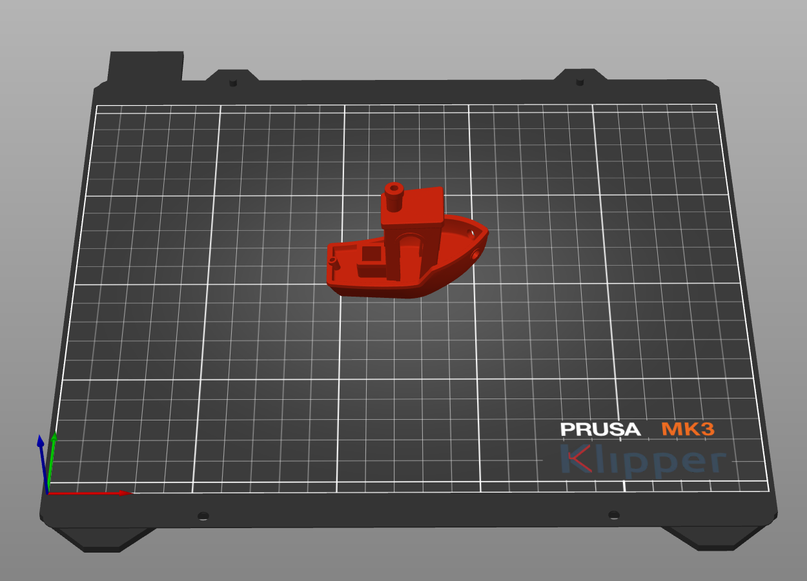
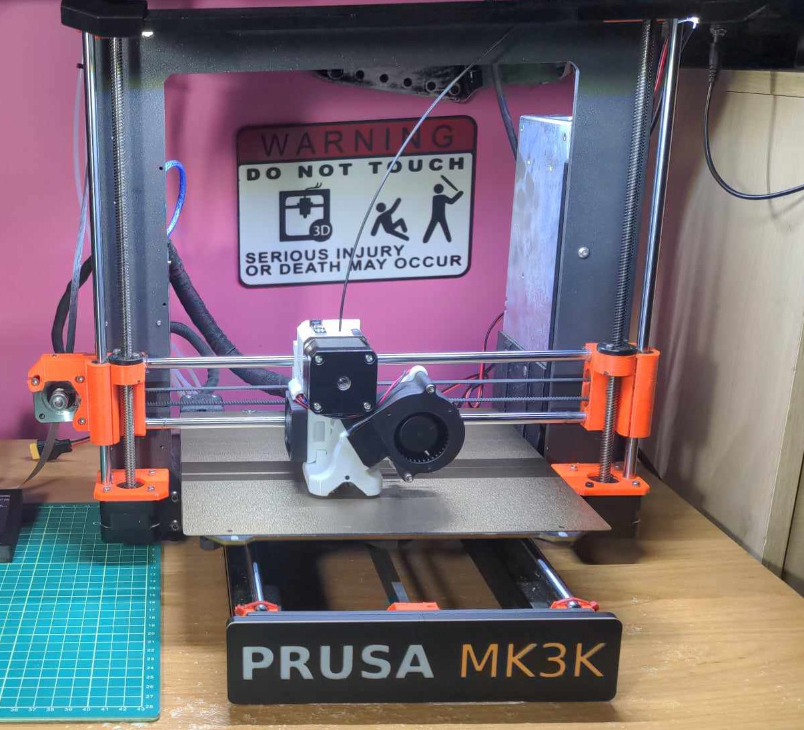

# Prusa MK3k

Prusa MK3k - My conversion of a Prusa MK3s+ clone to Klipper.

I've been running this [Fysetc Prusa MK3s+ clone](https://s.click.aliexpress.com/e/_oB2yb0x) for a few years now. I've always been tinkering with it from the beginning. Here is how it stands now with mods and upgrades.

# Installing Klipper

I've followed [charminULTRA's Klipper guide](https://github.com/charminULTRA/Klipper-Input-Shaping-MK3S-Upgrade) to get going initially. Recently I've pulled some changes from [project802's updated guide](https://github.com/project802/Klipper-Input-Shaping-MK3S-Upgrade)

# Additional Mods and Upgrades

- ~~Nylock~~ [Silicone Bed Level Mod](https://www.schweinert.com/silicone-bed-level-mod-prusa-mk3/): I'm using these [silicone tubes](https://s.click.aliexpress.com/e/_oCNcppl) with good success. I'm sure these [bed leving columns](https://s.click.aliexpress.com/e/_olThvdz) would work too if cut to length.
- [Raspberry Pi 4](https://s.click.aliexpress.com/e/_on8JnaX) and [5" MIPI Display](https://s.click.aliexpress.com/e/_onpiPqB): Before Klipper, I was very happy with OctoPrint which ran great on a Pi4. Klipper does requires a Raspberry Pi. Another alternative would be this [BTT Pi 2](https://s.click.aliexpress.com/e/_oEV29sb) which can be powered from screw terminals.  I'm using a 5" MIPI display with a [longer DSI cable](https://s.click.aliexpress.com/e/_oB68LnZ). 5-7" seems like a good sweet spot in screen sizes for klipperscreen.
- [Meanwell LRS-350-24 350w Power Supply](https://s.click.aliexpress.com/e/_oExWxLh): The power supply on my machine crapped out pretty early after installing Klipper. Likely unrelated, but I decided to upgrade to a bigger Meanwell 350w unit just in case. The power supply now powers the Pi4, LED lights and my MMU.
- [BTT MMB Cubic 1.0](https://s.click.aliexpress.com/e/_omvtHcw) with 6028 blower: I'm using the BTT MMB Cubic expansion board to drive 3 fans with Klipper. A 50mm fan for the Raspberry Pi, a 40mm fan for the electronics enclosure and a [6028](https://s.click.aliexpress.com/e/_ooHfhSW) part cooling fan
- [Mellow KMMP Power-off Module](https://s.click.aliexpress.com/e/_oBRjS79): converts the 24v into 5v that the Pi needs and also doubles a safety power down for the raspberry pi.
- [TZ 2.0 V6 hotend](https://s.click.aliexpress.com/e/_oofLEeJ): Rated at twice the flow rate of a normal v6 hotend.
- [MK4 0.9 degree steppers](https://s.click.aliexpress.com/e/_ok2TuVv): As per Prusa, the MK4 steppers should reduce VFA's, altough I haven't really tested that.
- [ERCF v2 MMU](https://s.click.aliexpress.com/e/_opTF3ZV) and [Seleadlab Filament Cutter](https://s.click.aliexpress.com/e/_okhysFz) kit. But I never took the time to get the MMU fully configured and running smoothly.
- [BTT S2DW](https://s.click.aliexpress.com/e/_okpRPtH) or [Mellow LIS2DW](https://s.click.aliexpress.com/e/_oncQHKS): I'm a big fan of any RP2040 based mcu for klipper because of how easy they are to flash. I'm using the BTT S2DW which claims to be more accurate than an ADXL345, although I'm sure either would work great.
- [MK4 Dual LED Light Bar 24v](https://s.click.aliexpress.com/e/_opsoeDh): I'm using a similar kit to this.
- [JUUPINE PEI Sheet](https://s.click.aliexpress.com/e/_oEQbZIX): Out of my collection of 20+ build plates, my favorite is this cheap PEI plate. 

# Printed STLs

- [Hard feet](https://www.thingiverse.com/thing:2805753/): My Prusa sits on these hard feet with some [felt](https://s.click.aliexpress.com/e/_oEwN37o) taped to the bottom
- [ADXL345 / S2DW mount](https://www.printables.com/model/901962-btt-adxl345-s2dw-bedslinger-mount) 
- [NEMA motor rotation indicator](https://www.thingiverse.com/thing:2638857): Will rotate along with your extruder motor. You will need a [8x3mm magnet](https://s.click.aliexpress.com/e/_oCzKxDc)
- [T-slot cover set](https://www.printables.com/model/1678-original-prusa-i3-mk3-3030-t-slot-extrusion-channe): prevents debris and dust from collecting inside your 3030 extrusion
- [Prusa MK3S RPi4](https://www.printables.com/model/74438-prusa-mk3s-rpi4b-mount-for-geekworm-aluminium-case): mount is compatible with full [aluminium enclosures](https://s.click.aliexpress.com/e/_oDRr7sw)
- [Big Einsy case](https://www.printables.com/model/31558-big-einsy-case) with this [40mm fan lid](https://www.printables.com/model/538337-new-big-einsy-case-lid-with-40mm-fan)
- [Meanwell LRS-350-24 350w Power Supply mounts](https://www.printables.com/model/10432-prusa-mk3-mean-well-lrs-350-specific-mount): to mount my Meanwell Powersupply unit to my MK3s+
- [TZ 2.0 adapter](https://www.printables.com/model/1280924-tz-20-adapter-for-mk3s) for the MK3s+, along with the [6028 blower](https://www.printables.com/model/1308000-tz-20-6028-fan-delta-p-fan-duct-adapter-for-mk3s) adapter for it
- [Customizable front plate](https://www.printables.com/model/1308004-prusa-front-plate-for-lcd-delete): As a finishing touch, I removed the front LCD and added a front plate.

# Slicer Settings

- My #SpeedBoatRace settings can be [downloaded here](https://github.com/8bitmcu/Prusa_MK3k/raw/refs/heads/main/SpeedBoatRace_PrintProfile.3mf)
- Optionally if you want to configure the Klipper bed picture as seen above, you can [download it here](https://raw.githubusercontent.com/8bitmcu/Prusa_MK3k/refs/heads/main/mk3s_klipper.svg)
